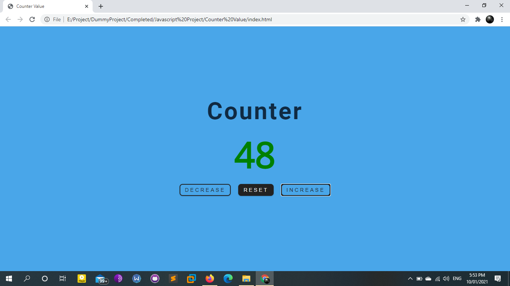
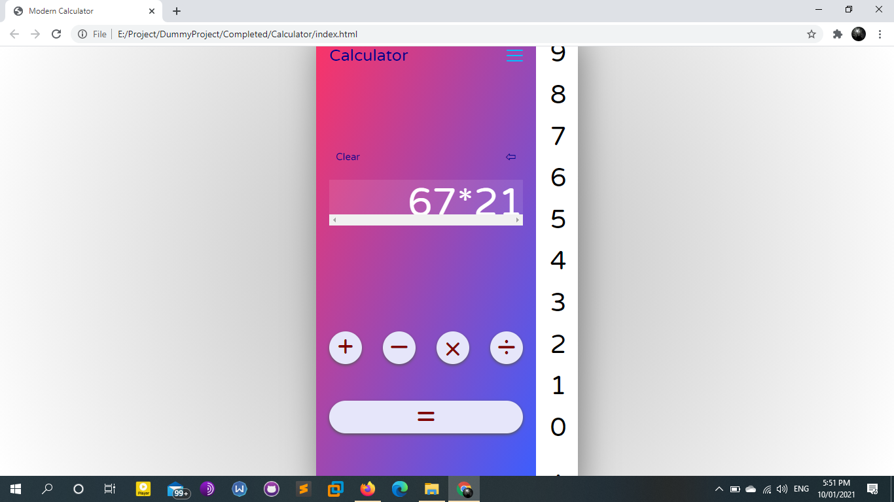
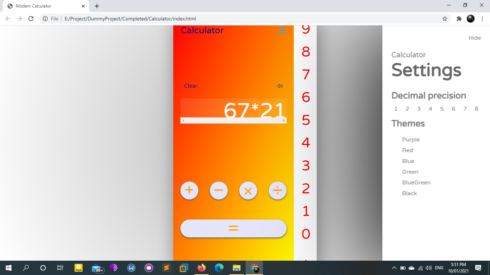
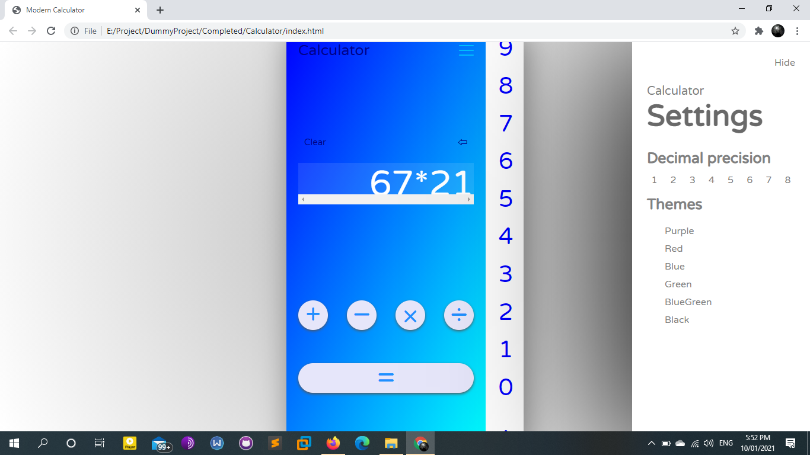
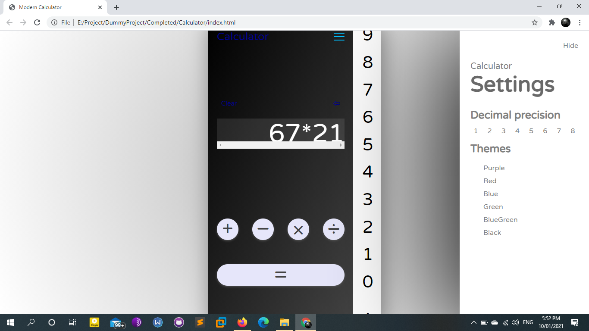
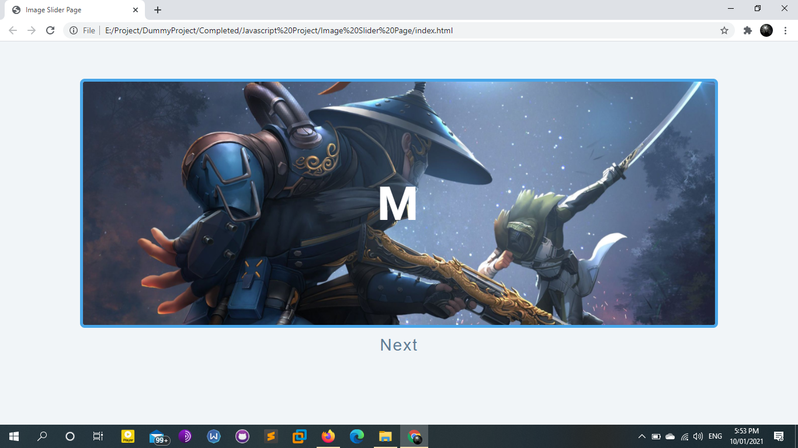
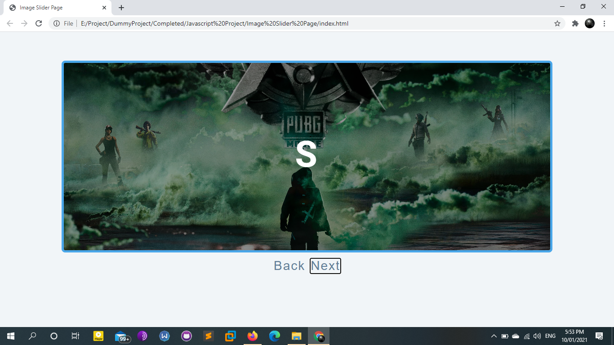
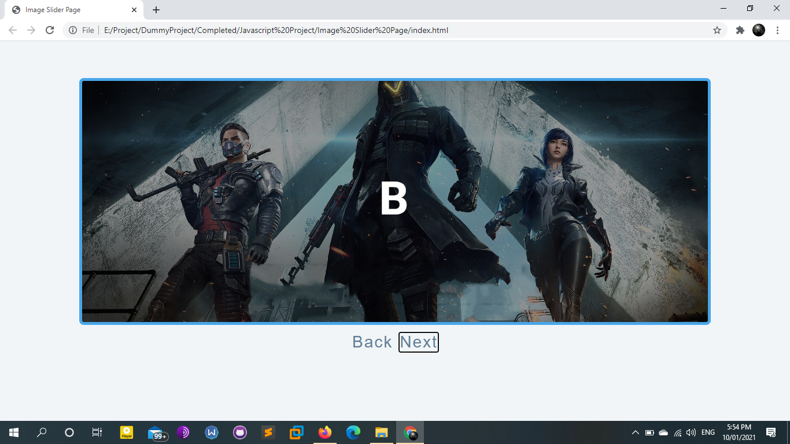
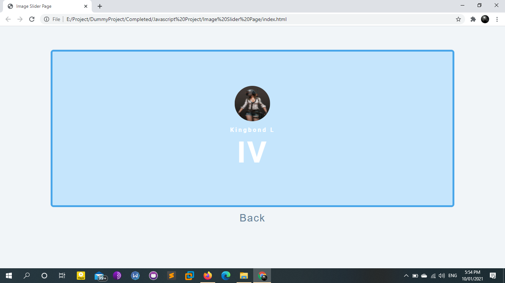

# Javascript-Project
It will show the implementation of javascript.

Reuirements for User:-
Download fontawesome-free-5.12.0-web from font awesome website.

BackGround Video Page

[Color Change](https://colorchangejs.netlify.app/)

[Counter Value](https://valuecounter.netlify.app/)

[Modern Calculator](https://calculatorismodern.netlify.app/)

[Image Slider Pagae](https://imagesliderpage.netlify.app/)

[Page Review](https://pagereview.netlify.app/)

[Paragraph Generator Page](https://paragraphgenerate.netlify.app/)

[Question and Answer Page](https://animeqna.netlify.app/)

[Sidebar Page](https://sidebarpage.netlify.app/)

[Tour Website Page](https://tourwebsitepage.netlify.app/)

[Yoga](https://yogatab.netlify.app/)

[Countdown Timer Giveaway](https://timercountdown0.netlify.app/)
